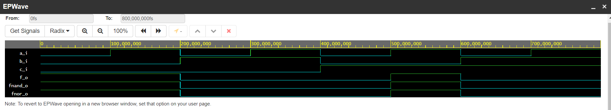

# Lab assigment 01-gates

## 1. Repository link 
Link to my repository: [tmarcak/Digital-electronics-1](https://github.com/tmarcak/Digital-electronics-1)

## 2. De Morgan's Law
Link to EDA playground: [De Morgan's Law](https://www.edaplayground.com/x/8Pat)

### Equations

### Table
| **c** | **b** |**a** | **f(c,b,a)** |
| :-: | :-: | :-: | :-: |
| 0 | 0 | 0 | 1 |
| 0 | 0 | 1 | 1 |
| 0 | 1 | 0 | 0 |
| 0 | 1 | 1 | 0 |
| 1 | 0 | 0 | 0 |
| 1 | 0 | 1 | 1 |
| 1 | 1 | 0 | 0 |
| 1 | 1 | 1 | 0 |

### De Morgan's Law Simulation

## 2. Distribution Laws

