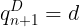
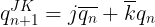
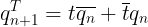
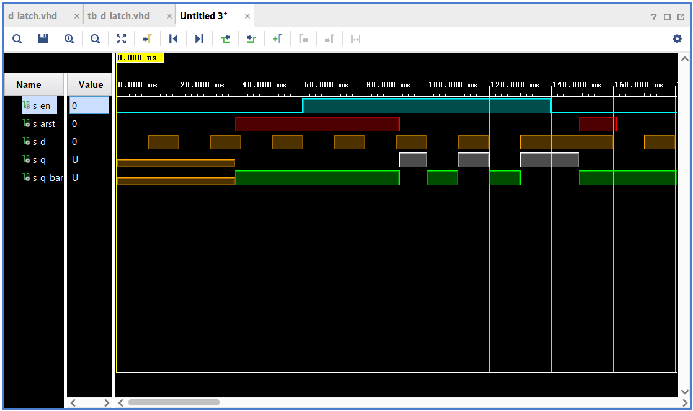
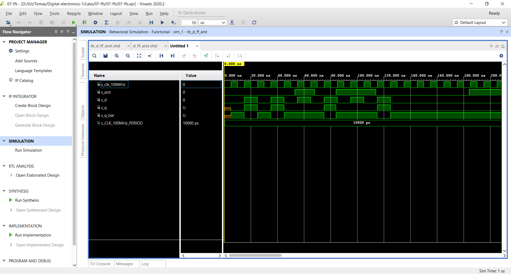
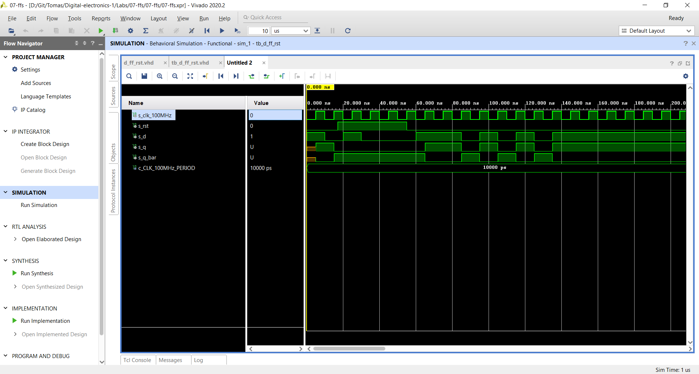
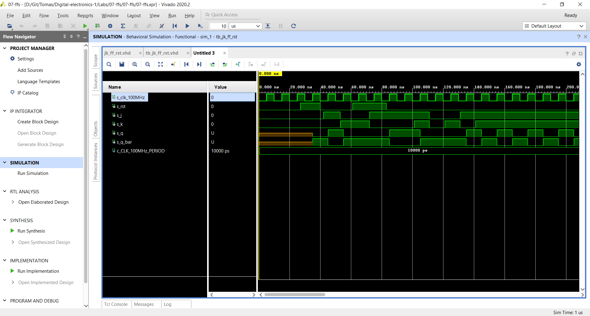
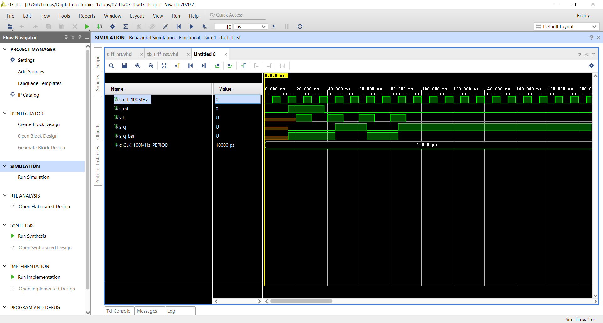
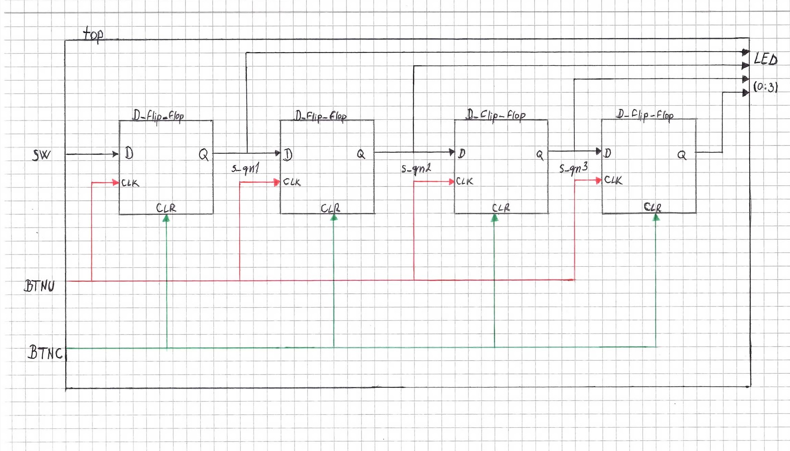

# Lab assignment 07- Latches and Flip-flops

Link to my repository: [tmarcak/Digital-electronics-1](https://github.com/tmarcak/Digital-electronics-1)

## 1. Preparation tasks 

### Characteristic equations and completed tables for D, JK, T flip-flops







### Table for D_FF

| **clk** | **d** | **q(n)** | **q(n+1)** | **Comments** |
| :-: | :-: | :-: | :-: | :-- |
|  | 0 | 0 | 0 | No change |
|  | 0 | 1 | 0 | Store |
|  | 1 | 0 | 1 | Store |
|  | 1 | 1 | 1 | No change |

### Table for JK_FF

| **clk** | **j** | **k** | **q(n)** | **q(n+1)** | **Comments** |
| :-: | :-: | :-: | :-: | :-: | :-- |
|  | 0 | 0 | 0 | 0 | No change |
|  | 0 | 0 | 1 | 1 | No change |
|  | 0 | 1 | 0 | 0 | Reset |
|  | 0 | 1 | 1 | 0 | Reset |
|  | 1 | 0 | 0 | 1 | Set |
|  | 1 | 0 | 1 | 1 | Set |
|  | 1 | 1 | 0 | 1 | Toggle |
|  | 1 | 1 | 1 | 0 | Toggle |

### Table for T_FF

| **clk** | **t** | **q(n)** | **q(n+1)** | **Comments** |
| :-: | :-: | :-: | :-: | :-- |
|  | 0 | 0 | 0 | No change |
|  | 0 | 1 | 1 | No change |
|  | 1 | 0 | 1 | Invert(Toggle) |
|  | 1 | 1 | 0 | Invert(Toggle) |

## 2. D latch

### VHDL code of the process (`p_d_latch`)

```vhdl
  p_d_latch : process (d, arst, en)
  begin
      if (arst = '1') then
          q     <= '0';
          q_bar <= '1';
            
      elsif (en = '1') then
          q     <= d;
          q_bar <= not d;
      end if;
  end process p_d_latch;
```
### VHDL code of the reset and stimulus processes from the testbench file (`tb_d_latch.vhd`)

```vhdl
  p_reset_gen : process
  begin
      s_arst <= '0';
      wait for 38 ns;
        
      -- Reset activated
      s_arst <= '1';
      wait for 53 ns;
        
      s_arst <= '0';
      wait for 58 ns;
        
      -- Reset activated
      s_arst <= '1';
      wait for 12 ns;
        
      s_arst <= '0';
      wait;
  end process p_reset_gen;


  p_stimulus : process
  begin
      report "Stimulus process started" severity note;
        
      s_d  <= '0';
      s_en <= '0';
      wait for 10 ns;
        
      --Remember values 
      s_d  <= '1';
      wait for 10 ns;
      s_d  <= '0';
      wait for 10 ns;
      s_d  <= '1';
      --Reset set to 1 
      wait for 10 ns;
      s_d  <= '0';
      wait for 10 ns;
      s_d  <= '1';
      wait for 10 ns;
    
      --Reseting output q
      s_d  <= '0';
      s_en <= '1';
      assert ((s_arst = '0') and (s_en = '1'))
      report "s_en setted to one -> Resetting output q" severity note;	
      wait for 10 ns;
        
      --Setting output q 
      s_d  <= '1';
      assert ((s_arst = '0') and (s_en = '1'))
      report "s_en setted to one -> Setting output q" severity note;	
      wait for 10 ns;
        
        
      s_d  <= '0';
      wait for 10 ns;   
      s_d  <= '1';
      wait for 10 ns;
      s_d  <= '0';
      wait for 10 ns;
      s_d  <= '1';
      --Reset set to 0  
      wait for 10 ns;
      s_d  <= '0';
      wait for 10 ns;
      s_d  <= '1';
      wait for 10 ns;
    
    
      -- Remember values 
      s_en <= '0';
      assert ((s_arst = '0') and (s_en = '0'))
      report "s_en setted to zero -> remember/hold value" severity note;
      wait for 10 ns;
        
      s_d  <= '1';
      wait for 10 ns;
      s_d  <= '0';
      wait for 10 ns;
      s_d  <= '1';
      wait for 10 ns;
      s_d  <= '0';
      wait for 10 ns;
      s_d  <= '1';
      --Reset set to 1 
      wait for 10 ns;
      s_d  <= '0';
      wait for 10 ns;
      s_d  <= '1';
      wait for 10 ns;
      s_d  <= '0';
        
      report "Stimulus process finished" severity note;
      wait;
  end process p_stimulus;
```

### Screenshot with simulated time waveforms



## 3. Flip-flops

### VHDL code listing of the processes (`p_d_ff_arst`), (`p_d_ff_rst`), (`p_jk_ff_rst`), (`p_t_ff_rst`)

### (`p_d_ff_arst`)

```vhdl
  p_d_ff_arst : process (clk,arst)
  begin
      if (arst = '1') then
          q     <= '0';
          q_bar <= '1';
            
      elsif rising_edge(clk) then
          q     <= d;
          q_bar <= not d;
      end if;
  end process p_d_ff_arst
```

### (`p_d_ff_rst`)

```vhdl
  p_d_ff_rst : process (clk)             
  begin
      if rising_edge(clk) then
          if (rst = '1') then
              q     <= '0';
              q_bar <= '1';
          else
              q     <= d;
              q_bar <= not d;
          end if; 
      end if;
  end process p_d_ff_rst;
```

### (`p_jk_ff_rst`)

```vhdl
  p_jk_ff_rst : process (clk)             
  begin                                         
    if rising_edge(clk) then 
        if (rst = '1') then
            s_q <= '0';
        else
               if (j = '0' and k = '0') then
                s_q  <=  s_q;
               
            elsif (j = '0' and k = '1') then
                s_q  <=  '0';
               
            elsif (j = '1' and k = '0') then
                s_q  <=  '1';
               
            elsif (j = '1' and k = '1') then                   
                s_q  <=  not s_q; 
                
            end if; 
          end if;                   
      end if;                                   
  end process p_jk_ff_rst;
```

### (`p_t_ff_rst`)

```vhdl
  p_t_ff_rst : process (clk)
  begin
      if rising_edge(clk) then
          if (rst = '1') then
              s_q     <=  '0';
              s_q_bar <=  '1';
          else
              if (t = '0') then
                  s_q     <=   s_q;
                  s_q_bar <=   s_q_bar;
              else
                  s_q     <=  not s_q;
                  s_q_bar <=  not s_q_bar;
              end if;    
          end if;
      end if;
  end process p_t_ff_rst;
```

### Listing of VHDL clock, reset and stimulus processes from the testbench files

### (`tb_d_ff_arst`)

```vhdl
------------------------------------------
--Clock generation process
------------------------------------------
  p_clk_gen : process
    begin
       while now < 750 ns loop         -- 75 periods of 100MHz clock
           
           s_clk_100MHz <= '0';
           wait for c_CLK_100MHz_PERIOD / 2;
           
           s_clk_100MHz <= '1';
           wait for c_CLK_100MHz_PERIOD / 2;
       
       end loop;
       wait;
   end process p_clk_gen;
 ------------------------------------------
 --Reset generation process
 ------------------------------------------    
  p_reset_gen : process
     begin
         s_arst <= '0';
         wait for 53 ns;
         
         -- Reset activated
         s_arst <= '1';
         wait for 15 ns;
 
         -- Reset deactivated
         s_arst <= '0';
         
         wait for 16 ns;
         s_arst <= '1';
         
         wait for 30 ns;
         s_arst <= '0';
         
         wait for 70 ns;
         s_arst <= '1';
 
         wait;
     end process p_reset_gen;

 ------------------------------------------
 --Data generation process
 ------------------------------------------ 
 p_stimulus : process
 begin
     report "Stimulus process started" severity note;
     s_d <= '0';
     
     --d sekv
     wait for 15 ns;
     s_d  <= '1';
     wait for 10 ns;
     s_d  <= '0';
     
     wait for 10 ns;
     s_d  <= '1';
     wait for 10 ns;
     s_d  <= '0';
     wait for 10 ns;
     s_d  <= '1';
     wait for 10 ns;
     s_d  <= '0';   
     --/d sekv
     
     --d sekv
     wait for 10 ns;
     s_d  <= '1';
     wait for 10 ns;
     s_d  <= '0';
     wait for 10 ns;
     s_d  <= '1';
     wait for 10 ns;
     s_d  <= '0';
     wait for 10 ns;
     s_d  <= '1';
     wait for 10 ns;
     s_d  <= '0';   
     --/d sekv
     
 report "Stimulus process finished" severity note;
 wait;
 end process p_stimulus;
```

### (`tb_d_ff_rst`)

```vhdl
------------------------------------------
--Clock generation process
------------------------------------------
 p_clk_gen : process
     begin
         while now < 750 ns loop         -- 75 periods of 100MHz clock
             
             s_clk_100MHz <= '0';
             wait for c_CLK_100MHz_PERIOD / 2;
             
             s_clk_100MHz <= '1';
             wait for c_CLK_100MHz_PERIOD / 2;
         
         end loop;
         wait;
     end process p_clk_gen;
     
 ------------------------------------------
 --Reset generation process
 ------------------------------------------    
  p_reset_gen : process
     begin
         s_rst <= '0';
         wait for 17 ns;
         
         -- Reset activated
         s_rst <= '1';
         wait for 38 ns;
 
         -- Reset deactivated
         s_rst <= '0';
         wait;
     end process p_reset_gen;
     
 ------------------------------------------
 --Data generation process
 ------------------------------------------ 
 p_stimulus : process
 begin
     report "Stimulus process started" severity note;
     s_d <= '1';
     
     --d sekv
     wait for 10 ns;
     s_d  <= '0';
     wait for 10 ns;
     s_d  <= '1';        
     wait for 10 ns;
     s_d  <= '0';
     wait for 10 ns;
     
     assert(s_q = '0' and s_q_bar = '1')
     report "Error" severity error;
     
     wait for 20 ns;
     s_d  <= '1';
     wait for 15 ns;
     
     assert(s_q = '1' and s_q_bar = '0')
     report "Error" severity error;
     --/d sekv
     
     --d sekv
     wait for 10 ns;
     s_d  <= '0';
     wait for 10 ns;
     s_d  <= '1';
     wait for 10 ns;
     s_d  <= '0';
     wait for 10 ns;
     s_d  <= '1';
     wait for 10 ns;
     s_d  <= '0';
     wait for 10 ns;
     s_d  <= '1';   
     --/d sekv
     
 report "Stimulus process finished" severity note;
 wait;
 end process p_stimulus;
```

### (`tb_jk_ff_rst`)

```vhdl
--------------------------------------------------------------------
-- Clock generation process
--------------------------------------------------------------------
 p_clk_gen : process
 begin
     while now < 750 ns loop         -- 75 periods of 100MHz clock
         
         s_clk_100MHz <= '0';
         wait for c_CLK_100MHz_PERIOD / 2;
         
         s_clk_100MHz <= '1';
         wait for c_CLK_100MHz_PERIOD / 2;
     
     end loop;
     wait;
 end process p_clk_gen;
 ------------------------------------------
 --Reset generation process
 ------------------------------------------     
  p_reset_gen : process
     begin
         s_rst <= '0';
         wait for 27 ns;
         
         -- Reset activated
         s_rst <= '1';
         wait for 13 ns;
 
         -- Reset deactivated
         s_rst <= '0';
         
         wait for 21 ns;
         s_rst <= '1';
         
         wait for 22 ns;
         s_rst <= '0';
         
         wait for 660 ns;
         s_rst <= '1';
 
         wait;
     end process p_reset_gen;

 ------------------------------------------
 --Data generation process
 ------------------------------------------    
 p_stimulus : process
 begin
     report "Stimulus process started" severity note;
     s_j <= '0';
     s_k <= '0';
     
     --d sekv
     wait for 15 ns;
     s_j <= '0';
     s_k <= '0';        
     wait for 27 ns;
     s_j <= '1';
     s_k <= '0';                       
     wait for 11 ns;
     s_j <= '0';
     s_k <= '1';        
     wait for 19 ns;
     s_j <= '1';
     s_k <= '0';       
     wait for 29 ns;
     s_j <= '1';
     s_k <= '1';
     --/d sekv
     
     --d sekv
     wait for 10 ns;
     s_j <= '0';
     s_k <= '0';             
     wait for 10 ns;
     s_j <= '0';
     s_k <= '1';     
     wait for 10 ns;
     s_j <= '1';
     s_k <= '0';     
     wait for 10 ns;
     s_j <= '1';
     s_k <= '1';
     --/d sekv
     
     report "Stimulus process finished" severity note;
     wait;
 end process p_stimulus;
```

### (`tb_t_ff_rst`)

```vhdl
--------------------------------------------------------------------
-- Clock generation process
--------------------------------------------------------------------
 p_clk_gen : process
 begin
     while now < 750 ns loop         -- 75 periods of 100MHz clock
         
         s_clk_100MHz <= '0';
         wait for c_CLK_100MHz_PERIOD / 2;
         
         s_clk_100MHz <= '1';
         wait for c_CLK_100MHz_PERIOD / 2;
     
     end loop;
     wait;
 end process p_clk_gen;
 
 ------------------------------------------
 --Reset generation process
 ------------------------------------------    
  p_reset_gen : process
     begin
         s_rst <= '0';
         wait for 15 ns;
         
         -- Reset activated
         s_rst <= '1';
         wait for 23 ns;
 
         -- Reset deactivated
         s_rst <= '0';
         wait;
     end process p_reset_gen;
     
 ------------------------------------------
 --Data generation process
 ------------------------------------------ 
 p_stimulus : process
 begin
     report "Stimulus process started" severity note;

     wait for 20 ns;
     s_t <= '1';  
     wait for 10 ns;
     s_t <= '0';                       
     wait for 10 ns;
     s_t <= '1';        
     wait for 10 ns;
     s_t <= '0';       
     wait for 10 ns;
     s_t <= '1';
     wait for 10 ns;
     s_t <= '0';
     wait for 10 ns;
     s_t <= '1';
     wait for 10 ns;
     s_t <= '0';

     assert(s_q='1' and s_q_bar = '0')
     report "Error" severity error;
         
     report "Stimulus process finished" severity note;
     wait;
 end process p_stimulus;
```

### Screenshot with simulated time waveforms

### (`d_ff_arst.vhd`)



### (`d_ff_rst.vhd`)



### (`jk_ff_rst.vhd`)



### (`t_ff_rst.vhd`)



## 4. Shift register 



