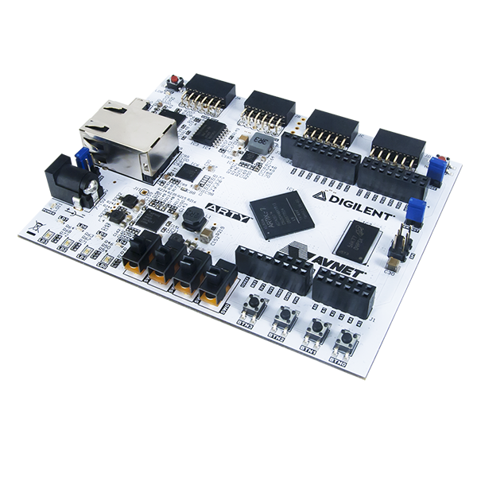
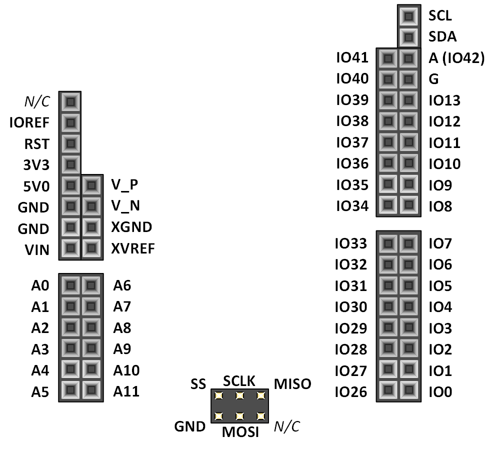
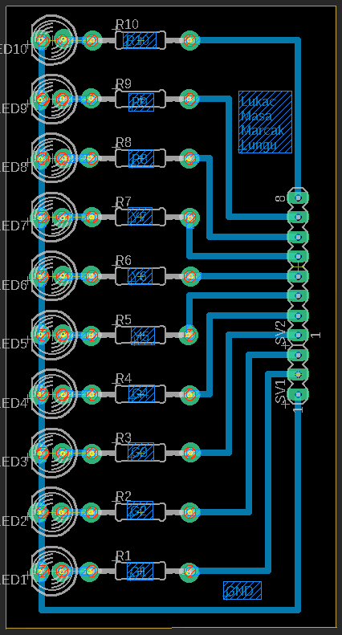
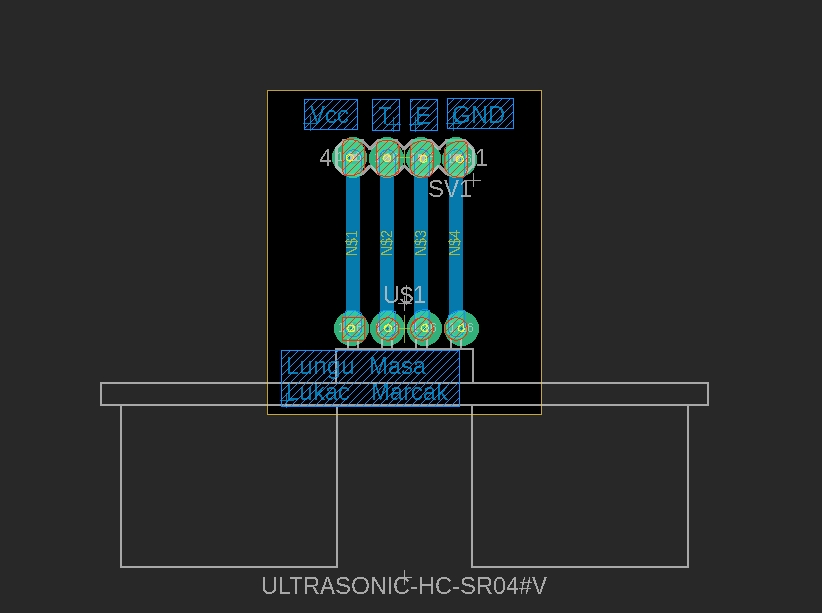
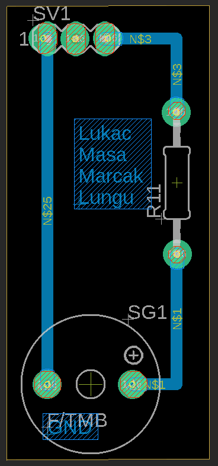

# DE1 Project assignment - Parking assistant

### Team members
Vladimír Lukáč, Masauso Lungu, Tomáš Marčák, Vít Maša

Link to our GitHub project folder: [Project folder](https://github.com/tmarcak/Digital-electronics-1)

### Project objectives

## Hardware description

# Arty A7

The Arty A7, formerly known as the Arty, is a ready-to-use development platform designed around the Artix-7™ Field Programmable Gate Array (FPGA) from Xilinx.
It was designed specifically for use as a MicroBlaze Soft Processing System. When used in this context, the Arty A7 becomes the most flexible processing platform you could hope to add to your collection, capable of adapting to whatever your project requires. 
The Arty A7 is fully compatible with the high-performance Vivado ® Design Suite. It is supported under the free WebPACK™ license, so designs can be implemented at no additional cost. [1]

# HC-SR04 ultrasonic sensor

The HC-SR04 ultrasonic sensor uses sonar to determine distance to an object like bats do. 
It offers excellent non-contact range detection with high accuracy and stable readings in an easy-to-use package. 
It comes complete with ultrasonic transmitter and receiver modules. This sensor is very popular among the Arduino tinkerers. [2]

# Board

Our designed board in Eagle software. 

# Buzzer
For sound signalization with PWM we chose simple Piezo Buzzer. 
Piezo buzzers are simple devices that can generate basic beeps and tones.  
They work by using a piezo crystal. It is a special material that changes shape when voltage is applied to it.  
If the crystal pushes against a diaphragm, like a tiny speaker cone, it can generate a pressure wave which the human ear picks up as sound.  
Simple change the frequency of the voltage sent to the piezo and it will start generating sounds by changing shape very quickly!

# LED bargraph
As visual signalization we chose 10 segment LED bargraph, where are 5 green segment which signalizated there is lots of free space (3m - 1,6m), 3 yellow segment which signalizated correct possition for parking (1,6m - 1m) and 2 red segments which signalizated there is not enought space and you have to stop or you can crash your car. 
Correct possition for parking in city is middle yellow segment, because you must keep a distance of at least 1.2m between the vehicles for safe leave, but when you park in home garage, you can park closser to safe space.

# Pin cables

## VHDL modules description and simulations

# HC-SR04 Ultrasonic sensor
# Sensor_control_unit
# Sensor_logic_unit
# Buzzer
# Buzzer_control_unit
# LED bar
# LED_bar_control_unit

## TOP module description and simulations

# Top module diagram

.

## Video

*Write your text here*

## References

   1. Arty A7 board description. In: digilentinc.com [online]. Available here: [Arty A7](https://reference.digilentinc.com/reference/programmable-logic/arty-a7/reference-manual) 
   2. HC-SR04 ultrasonic sensor description. In: randomnerdtutorials.com [online]. Available here: [HC-SR04](https://randomnerdtutorials.com/complete-guide-for-ultrasonic-sensor-hc-sr04/) 